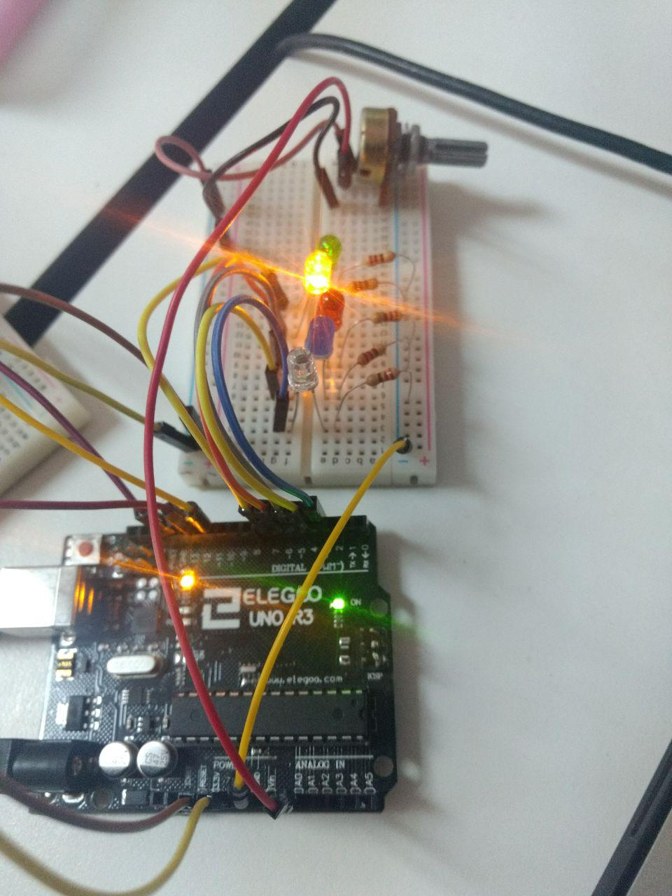
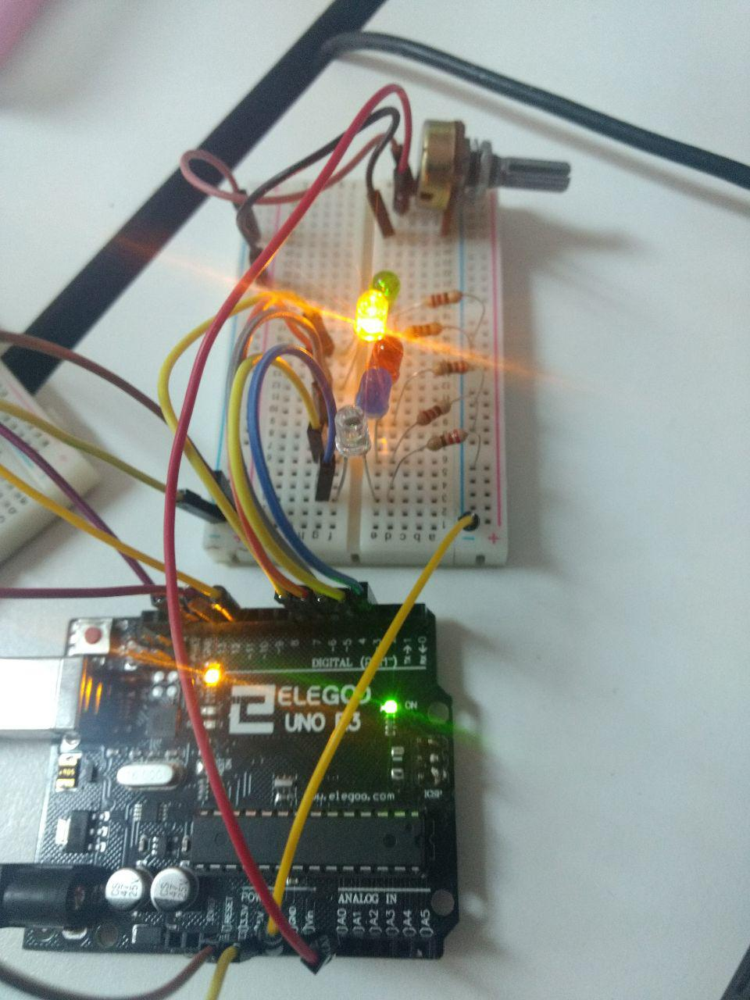

# Practica-Semaforo

Esta practica consiste en realizar una automatizacion de un semaforo 
con el fin de determinar cuando poner en rojo un semaforo, dandole 
una presion a un boton y determinar si es adecuado que se ponga en rojo,
con otra configuracion tambien podemos crear un semaforo como el que se utilizan
en las carreras donde cambia consecutivamente con un potenciomentro.

# Materiales

 Potenciometro
 Arduino
 Leds 6
 Resistencias 6
 Cables

# Imagenes

